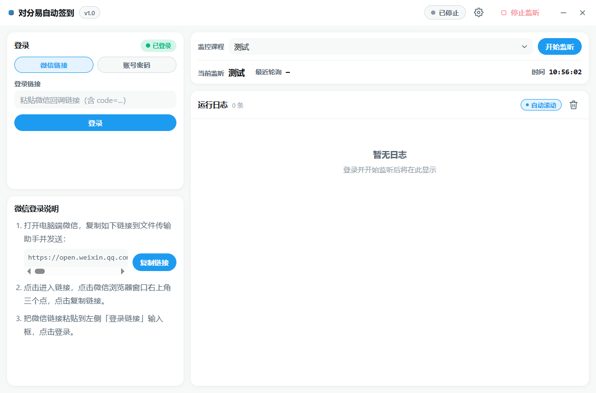

# 🎓 对分易自动签到

> 对分易自动签到工具，持续监听对分易课堂签到活动，自动完成签到码 / 二维码 / 定位三类签到





## 🚀 快速上手


### 运行环境

程序界面基于 WebView2 渲染。Windows 10（1803+）与 Windows 11 通常随系统自带；
若启动时提示缺少 WebView2，运行仓库根目录的 `WebView2Setup.exe` 安装即可。

### 安装与运行

```bash
# 1. 获取源码
git clone https://github.com/bytehola/duifene_auto_sign.git
cd duifene_auto_sign

# 2. 安装依赖
pip install -r requirements.txt

# 3. 启动程序
python main.py
```

### 打包发布（Windows）

```bash
# 在干净的虚拟环境中构建，避免无关依赖混入产物
python -m venv build_env
build_env\Scripts\pip install -r requirements.txt pyinstaller

# onedir 模式，产物在 dist\对分易自动签到\
build_env\Scripts\pyinstaller build.spec --noconfirm
```

---

## 📖 使用指南

### 启动流程

1. 在左栏「登录」面板选择登录方式：
   - **微信链接**：按说明复制微信授权链接登录。
   - **账号密码**：填写对分易账号密码登录（不支持二维码签到）。
3. 登录成功后，右栏「监控课程」下拉列表选择课程。
4. 选择目标课程，点击「开始监听」即进入监控签到活动。

### 自动签到逻辑

| 签到类型 | 处理策略 |
|---------|---------|
| 签到码 (type=1) | 直接提交 4 位签到码 |
| 二维码 (type=2) | 以活动 ID 作为 state 提交（仅微信链接登录有效） |
| 定位签到 (type=3) | 坐标来源优先级：WS 推送跟随 → 班级缓存 → 三边反推 |

---

## 📄 开源协议

本项目基于 MIT License 发布。
